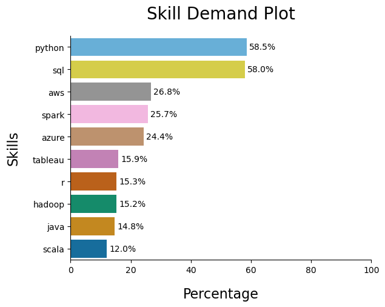
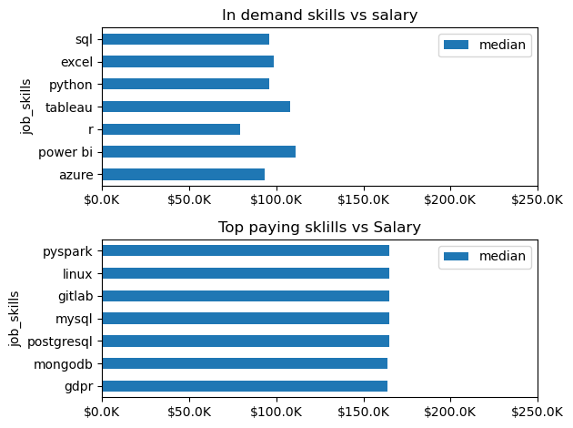

# Overview

Welcome to my analysis of the data job market, focusing on data analyst roles. This project was created out of a desire to navigate and understand the job market more effectively. It delves into the top-paying and in-demand skills to help find optimal job opportunities for data analysts.

The data sourced from [Luke Barousse's Python Course](https://lukebarousse.com/python) which provides a foundation for my analysis, containing detailed information on job titles, salaries, locations, and essential skills. Through a series of Python scripts, I explore key questions such as the most demanded skills, salary trends, and the intersection of demand and salary in data analytics.

# The Questions

Below are the questions I want to answer in my project:

1. What are the skills most in demand for Data Analyst Jobs?
2. How are in-demand skills trending for Data Analysts?
3. How well do jobs and skills pay for Data Analysts?
4. What are the optimal skills for data analysts to learn? (High Demand AND High Paying) 

# Tools I Used

For my deep dive into the data analyst job market, I harnessed the power of several key tools:

- **Python:** The backbone of my analysis, allowing me to analyze the data and find critical insights.I also used the following Python libraries:
    - **Pandas Library:** This was used to analyze the data. 
    - **Matplotlib Library:** I visualized the data.
    - **Seaborn Library:** Helped me create more advanced visuals. 
- **Jupyter Notebooks:** The tool I used to run my Python scripts which let me easily include my notes and analysis.
- **Visual Studio Code:** My go-to for executing my Python scripts.
- **Git & GitHub:** Essential for version control and sharing my Python code and analysis, ensuring collaboration and project tracking.

# Data Preparation and Cleanup

This section outlines the steps taken to prepare the data for analysis, ensuring accuracy and usability.

## Import & Clean Up Data
 I start by loading the data and importing the required modules
  
```python
  # Importing Libraries
import ast
import pandas as pd
import seaborn as sns
from datasets import load_dataset
import matplotlib.pyplot as plt
# Loading Data
the_lukbarset=load_dataset('lukebarousse/data_jobs')
data_fram=the_lukbarset['train'].to_pandas()

# Data Cleanup
data_fram['job_posted_date'] = pd.to_datetime(df['job_posted_date'])
data_fram['job_posted_date']=pd.to_datetime(data_fram.job_posted_date)
data_fram1['job_skills']=data_fram1['job_skills'].apply(lambda skill: ast.literal_eval(skill) if pd.notna(skill) else skill)
```
## Filter India Jobs

To focus my analysis on the U.S. job market, I apply filters to the dataset, narrowing down to roles based in the India.

```python
data_fram_India = data_fram[data_fram['job_country'] == 'India']

```

# The Analysis

Each Jupyter notebook for this project aimed at investigating specific aspects of the data job market. Here’s how I approached each question:

## 1. What are the most demanded skills for the Data Analytic roles?

To find the most demanded skills for the Data Analytic's roles. I filtered out those positions by which ones were the most popular, and got the top 10 skills . This query highlights the most popular job titles and their top skills, showing which skills I should pay attention to depending on the role I'm targeting. 

View my notebook with detailed steps here: [2_Skill_Demand](2_Skill_Demand.ipynb).
### Visualize Data

```python
new_frame['total_jobs']=len(data_fram1[data_fram1['job_country']=='India'])
new_frame['percentage']=(new_frame['count']/new_frame['total_jobs'])*100
ax=sns.barplot(data=new_frame,y='job_skills',x='percentage',palette='colorblind',hue='percentage')
sns.despine()
plt.legend().remove()
plt.title(label='Skill Demand Plot',pad=20,fontsize=20,loc='center')
plt.ylabel(ylabel='Skills',fontsize=16,labelpad=15)
plt.xlabel(xlabel='Percentage',fontsize=16,labelpad=15)
plt.xlim(0,100)

for container in ax.containers:
    ax.bar_label(container, fmt='%1.1f%%', padding=3)

```
### Results
 

*Bar graph visualizing the salary for the  top 5 skills associated with Data Analyst Job.*

### Insights 

 Sql is the most demanded skill in the Data Analyst Industry then python 

## 2. How are in-demand skills trending for Data Analysts?
   I cleaned the original frame and made it specific for India and for the job Data Analyst
  I  sorted the skills by the months so I added two columns the month name and the month 
  number then I sorted the data frame using the month number. Then I created a pivot table and used size function to get the count of the skill for each job month.
  view my notebook for the detailed steps: [Trending_skills](3_skill_trend.ipynb)
  ### visualize data
  ```python
  sns.lineplot(data=merged_frame_final,dashes=False,legend='full',palette='tab10')
plt.xticks(rotation=45)
sns.set_theme()
plt.gca().yaxis.set_major_formatter(PercentFormatter(decimals=0))
plt.legend().remove()
plt.Figure(figsize=(10,5))
plt.xlim(0,13)
for i,skill in enumerate(top_skills):
 plt.text(11.4,merged_frame_final.iloc[-1,i],merged_frame_final.columns[i])
   ``` 
  ### result
  

  *Line chart visualization for trending skills.* 

 ### Insights
 In India for most of the skill the demand is quite similar all along the year in India.
## 3. How well do jobs and skills pay for Data Analysts?
To identify the highest-paying roles and skills, I only got jobs in India and looked at their median salary. But first I looked at the salary distributions of common data jobs like Bussiness Analyst, Data Engineer, and Data Analyst,and etc to get an idea of which jobs are paid the most. 

View my notebook with detailed steps here: [4_Salary_Analysis](4_salary_analysis.ipynb).

#### Visualize Data 

```python
container=[]
for job in top_job_titles:
    container.append(data_fram2[data_fram2['job_title_short']==job]['salary_year_avg'].values)
sns.boxplot(data=container,orient='h',medianprops=dict(color='red', linewidth=1))
plt.yticks(ticks=range(0,len(top_job_titles)),labels=top_job_titles)
plt.xlim(0,300000)

```

#### Results

  
*Box plot visualizing the salary distributions for the top 5 data job titles.*

#### Insights
   Machine Learning Engineers earn the most on average, but salaries vary a lot → high risk, high reward role.
	 Data Scientists and Data Engineers sit in the strong middle, with Data Scientists slightly ahead in median pay.
	 Data Analysts and Business Analysts earn the least, with tighter salary ranges → more entry-level friendly but slower growth.
	 Higher-paying roles show larger spread, meaning experience and skill level matter more than the job title alone.

### Heighest Paid and most demanded skills for Data Analytics
Next, I narrowed my analysis and focused only on data analyst roles. I looked at the highest-paid skills and the most in-demand skills. I used two bar charts to showcase these.

#### Visualize Data

```python

fig , ax=plt.subplots(2,1)
skill_indemand.plot(kind='barh',y='median',ax=ax[0])
top_10paying.plot(kind='barh',y='median',ax=ax[1],xlim=(0,250000))
ax[0].set_title('In demand skills vs salary')
ax[1].set_title('Top paying sklills vs Salary')
ax[0].set_xlim(ax[1].get_xlim())
ax[0].invert_yaxis()
ax[1].invert_yaxis()
ax[0].xaxis.set_major_formatter(plt.FuncFormatter(lambda x,_ : f'${x/1000}K'))
ax[1].xaxis.set_major_formatter(plt.FuncFormatter(lambda x,_ : f'${x/1000}K'))

plt.tight_layout()

```

#### Results
Here's the breakdown of the highest-paid & most in-demand skills for data analysts in the India:



*Two separate bar graphs visualizing the  most in-demand skills and highest paid skills a for data analysts in the India.*

#### Insights:
##### Demand
QL, Excel, Python → very high demand but moderate median salary (~90–100k)
High demand doesnt mean great pay 
ableau & Power BI → slightly higher median (~100–110k)
 Visualization tools pay a bit more than pure querying/reporting.
##### High Pay
PySpark → highest or among the highest
 Strong signal for big data & data engineering roles.

Linux + GitLab → infra & production-level skills
 Companies pay more for people who can deploy, automate, and maintain systems.

MySQL, PostgreSQL, MongoDB → databases beyond basics
 Indicates backend/data engineering depth.
The noticeable thing is that the top paying skills pay doesnt vary much in India according to the Data
## 4. What are the most optimal skills to learn for Data Analysts?

To identify the most optimal skills to learn ( the ones that are the highest paid and highest in demand) I calculated the percent of skill demand and the median salary of these skills. To easily identify which are the most optimal skills to learn. 

View my notebook with detailed steps here: [5_Optimal_Skills](5_optimal_skills.ipynb).

#### Visualize Data

```python
sns.scatterplot(data=plot_data,x='count',y='median',alpha=0.6,sizes=(20,200))
texts=[]
for i,skill in enumerate(trending_skill):
     
     texts.append(plt.text(x=plot_data['count'].loc[skill]+0.5,y=plot_data['median'].loc[skill]+0.5,s=trending_skill[i],fontsize=9))

adjust_text(
    texts,
    arrowprops=dict(
        arrowstyle='->',
        lw=0.8,
        color='gray'
    ))

sns.despine()
plt.tight_layout()
```

#### Results

    
*A scatter plot visualizing the most optimal skills (high paying & high demand) for data analysts in India.*

#### Insights:
QL & Excel have the highest demand (count) but only mid-level median pay
very common skills, essential but not premium by themselves.

Python sits in a sweet spot: high demand + solid median salary
strong core skill, boosts pay when combined with others.

BI tools (Power BI, Looker, Tableau) show high median salaries despite lower counts
niche + specialization = better pay.

Cloud skills (Azure, AWS, Oracle) have lower paired demand but decent pay
valuable as secondary skills, not standalone for most roles.

R shows low demand and lower median salary
declining industry relevance compared to Python.

# What I Learned

Throughout this project, I deepened my understanding of the data analyst job market and enhanced my technical skills in Python, especially in data manipulation and visualization. Here are a few specific things I learned:

- **Advanced Python Usage**: Utilizing libraries such as Pandas for data manipulation, Seaborn and Matplotlib for data visualization, and other libraries helped me perform complex data analysis tasks more efficiently.
- **Data Cleaning Importance**: I learned that thorough data cleaning and preparation are crucial before any analysis can be conducted, ensuring the accuracy of insights derived from the data.
- **Strategic Skill Analysis**: The project emphasized the importance of aligning one's skills with market demand. Understanding the relationship between skill demand, salary, and job availability allows for more strategic career planning in the tech industry.


# Insights

This project provided several general insights into the data job market for analysts:

- **Skill Demand and Salary Correlation**: There is a clear correlation between the demand for specific skills and the salaries these skills command. Advanced and specialized skills like Python and Oracle often lead to higher salaries.
- **Market Trends**: There are changing trends in skill demand, highlighting the dynamic nature of the data job market. Keeping up with these trends is essential for career growth in data analytics.
- **Economic Value of Skills**: Understanding which skills are both in-demand and well-compensated can guide data analysts in prioritizing learning to maximize their economic returns.


# Challenges I Faced

This project was not without its challenges, but it provided good learning opportunities:

- **Data Inconsistencies**: Handling missing or inconsistent data entries requires careful consideration and thorough data-cleaning techniques to ensure the integrity of the analysis.
- **Complex Data Visualization**: Designing effective visual representations of complex datasets was challenging but critical for conveying insights clearly and compellingly.
- **Balancing Breadth and Depth**: Deciding how deeply to dive into each analysis while maintaining a broad overview of the data landscape required constant balancing to ensure comprehensive coverage without getting lost in details.


# Conclusion


This exploration into the data analyst job market has been incredibly informative, highlighting the critical skills and trends that shape this evolving field. The insights I got enhance my understanding and provide actionable guidance for anyone looking to advance their career in data analytics. As the market continues to change, ongoing analysis will be essential to stay ahead in data analytics. This project is a good foundation for future explorations and underscores the importance of continuous learning and adaptation in the data field.
